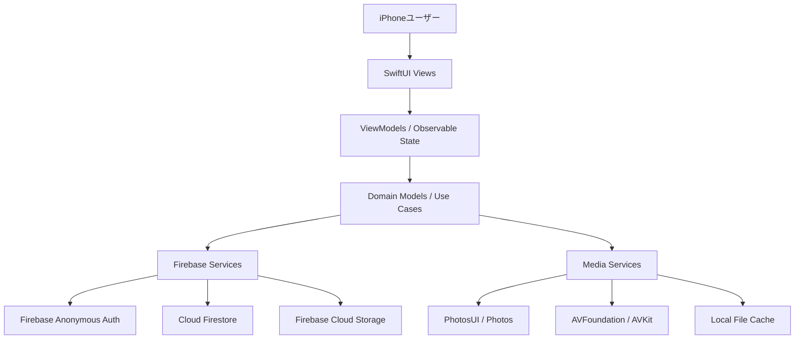

# SelectBestPhoto アーキテクチャ設計

## 1. 概要

- 要件名: select-best-photo
- 作成日: 2026-06-22
- 入力資料:
  - `docs/requirements.md`
  - `docs/spec/select-best-photo/requirements.md`
  - `docs/spec/select-best-photo/user-stories.md`
  - `docs/spec/select-best-photo/acceptance-criteria.md`
  - `docs/tech-stack.md`
- 対象: iOS 18以降のiPhone専用SwiftUIアプリ

### 信頼性レベル

| 記号 | 意味 |
| --- | --- |
| 🔵 | 要件定義、技術スタック、ヒアリングから直接確認できる |
| 🟡 | 既存資料とヒアリングから実装可能性のために妥当に補完した |
| 🔴 | 既存資料にない推測 |

## 2. 全体構成



- SwiftUI + MVVMを基本に、機能単位でView、ViewModel、Service、Modelを分離する。🔵 出典: `docs/tech-stack.md`
- 状態管理はSwiftUI標準の状態管理とObservationを基本にする。🔵 出典: `docs/tech-stack.md`
- 非同期処理はSwift Concurrencyを使用し、Firebase SDKの非同期処理をService層でラップする。🔵 出典: `docs/tech-stack.md`
- 独自APIサーバーは置かず、FirebaseをBackend as a Serviceとして利用する。🔵 出典: `docs/tech-stack.md`
- 結果発表の公開条件はクライアント表示制御だけでなくFirestore Security Rulesでも保護する。🔵 出典: `docs/spec/select-best-photo/requirements.md`

## 3. レイヤー責務

| レイヤー | 主な責務 | 信頼性 |
| --- | --- | --- |
| App | Firebase初期化、NavigationStack起点、依存生成 | 🔵 |
| Features | Pairing、MonthlyBest、AnnualBest、CustomCategories、TextCategories、RevivalPicks、ResultReveal、Settings の画面とViewModel | 🔵 |
| Models | Firestore保存モデル、ドメインモデル、ランキング、入力状態、メディア参照 | 🔵 |
| Services/Firebase | Auth、Pair、Firestore同期、Storageアップロード、Rules前提の読み書き | 🔵 |
| Services/Media | PhotosUI選択、写真圧縮、動画圧縮、Live Photos分離、サムネイル生成、位置情報除外 | 🔵 |
| Services/Cache | 圧縮済みメディアとサムネイルのファイルキャッシュ | 🟡 |
| Shared | 共通UI、日付、順位、エラー表示、ログ制御 | 🔵 |

## 4. 推奨ディレクトリ構成

```text
SelectBestPhoto/
├── App/
├── Features/
│   ├── Pairing/
│   ├── MonthlyBest/
│   ├── AnnualBest/
│   ├── CustomCategories/
│   ├── TextCategories/
│   ├── RevivalPicks/
│   ├── ResultReveal/
│   └── Settings/
├── Models/
├── Services/
│   ├── Firebase/
│   ├── Media/
│   └── Cache/
├── Shared/
└── Resources/
```

- 構成は `docs/tech-stack.md` の推奨構成を採用し、Storage専用層はFirebase層へ含めてもよい。🔵
- ViewModelはFirestore/Storage SDKを直接触らず、Serviceインターフェース経由で操作する。🟡
- テストではServiceを差し替えられるよう、主要Serviceはprotocolで境界を切る。🟡

## 5. Firebase設計方針

- 認証はFirebase Anonymous Authenticationを使用し、明示的なログイン画面は設けない。🔵
- ペア作成時に短期限のペアコードを発行し、参加完了後に失効させる。🔵 ヒアリング決定
- Firestoreは `pairs/{pairId}/years/{year}/months/{month}` を中心に、年/月単位で入力、設定、公開結果を分割する。🔵 ヒアリング決定
- 結果発表用データは個別入力から分離し、両者完了後に公開用結果ドキュメントとして作成する。🔵 ヒアリング決定
- 公開用結果ドキュメントはCloud Functionsなしで、クライアントがFirestoreトランザクションで生成する。🔵 ヒアリング決定
- Storageメディアは `mediaAssets` として独立管理し、参照元と削除候補を記録して巻き込み削除を防ぐ。🔵 ヒアリング決定

## 6. メディア処理方針

- 通常の写真はアップロード前にJPEG互換形式へ圧縮し、表示用画像とサムネイルを保存する。Live Photos全体をJPEG単体へ変換する方針ではない。🔵 ヒアリング決定
- 動画はH.264 MP4へ圧縮し、再生用動画とサムネイルを保存する。🔵 ヒアリング決定
- Live Photosは通常写真として潰さず、静止画部分とモーション部分を対応付け、アプリ上でLive Photosとして再生可能な参照として保存する。🔵
- メタデータは原則保持するが、GPSなど位置情報はアップロード対象から除外する。🔵 ヒアリング決定
- 元のiPhone写真ライブラリおよびiCloud写真上のデータは変更、削除しない。写真ライブラリの削除・変更系APIは使用せず、削除対象はFirebase Cloud Storage上の派生ファイルに限定する。🔵
- 圧縮後の解像度、画質、ビットレート、ファイルサイズ上限は技術検証で決定する。🔵

## 7. 公開条件とセキュリティ

- ユーザーは自分の入力だけを編集でき、相手の入力は編集できない。🔵
- 両者入力完了前は、相手の入力内容ではなく入力状態のみを表示する。🔵
- Firestore Rulesは、未公開の個別入力を相手が直接読めない構造を前提にする。🔵
- 公開用結果ドキュメントは、両者の入力完了を示す状態と紐づけて読み取り可能にする。🟡
- ペアコード、ユーザーID、写真パス、個人情報をログへ出さない。🔵
- App Checkは初期必須依存にせず、本番に近い運用へ進む前に導入を検討する。🔵

## 8. ローカル状態とキャッシュ

- Firestoreを同期状態の正とし、ローカルは表示速度改善用のファイルキャッシュを中心にする。🔵 ヒアリング決定
- 入力途中の画面状態はViewModelで保持し、保存操作時にFirestoreへ反映する。🟡
- 圧縮済みメディアとサムネイルはローカルファイルキャッシュへ保存し、Storageダウンロード回数と表示待ち時間を抑える。🟡
- SwiftDataは初期必須にせず、オフライン要件や一覧性能で必要になった場合に検討する。🔵 ヒアリング決定

## 9. 依存関係

- 初期Firebase SDKは `FirebaseCore`、`FirebaseAuth`、`FirebaseFirestore`、`FirebaseStorage` をSPMで導入する。🔵
- 画像、動画、Live PhotosはApple標準APIを優先する。🔵
- `.csv` と手入力を初期実装の安定対象にし、`.xlsx` は標準APIまたは最小依存で技術検証後に実装する。🔵 ヒアリング決定
- SwiftLint、SwiftFormatはXcodeプロジェクト作成後に設定する。🔵

## 10. 未決定・技術検証事項

| 項目 | 方針 | 信頼性 |
| --- | --- | --- |
| 写真圧縮基準 | 解像度、画質、ファイルサイズを検証で決定 | 🔵 |
| 動画圧縮基準 | 解像度、ビットレート、長さ、ファイルサイズを検証で決定 | 🔵 |
| Live Photos保存形式 | 静止画とモーション部分の具体フォーマットを検証で決定 | 🔵 |
| 想定メディア件数 | Firebase費用と操作性を踏まえて検証 | 🔵 |
| `.xlsx`解析 | 初期はCSV優先、XLSXは依存追加前に検証 | 🔵 |
| 結果発表演出 | デザイン検討で具体化 | 🔵 |
