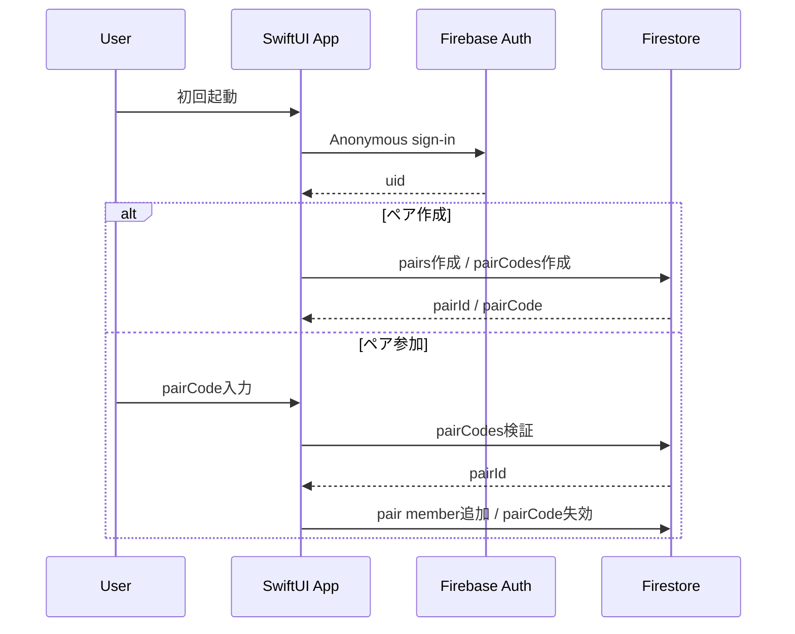
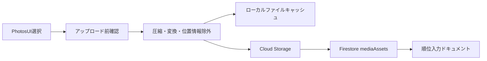
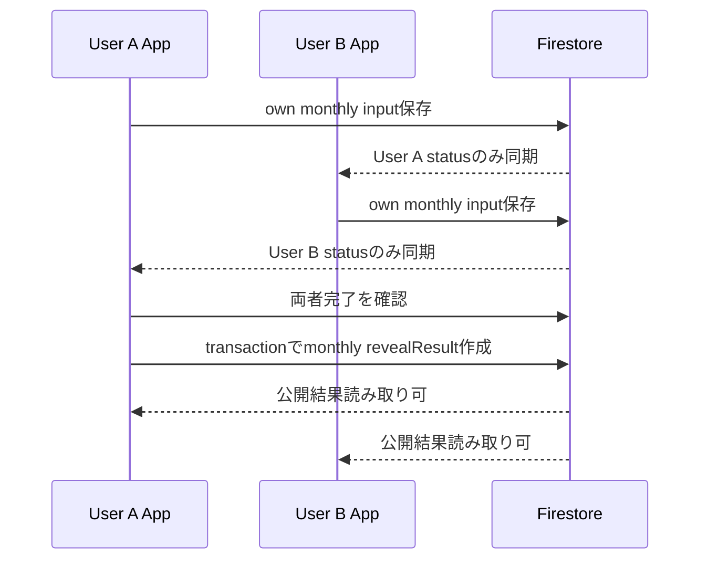
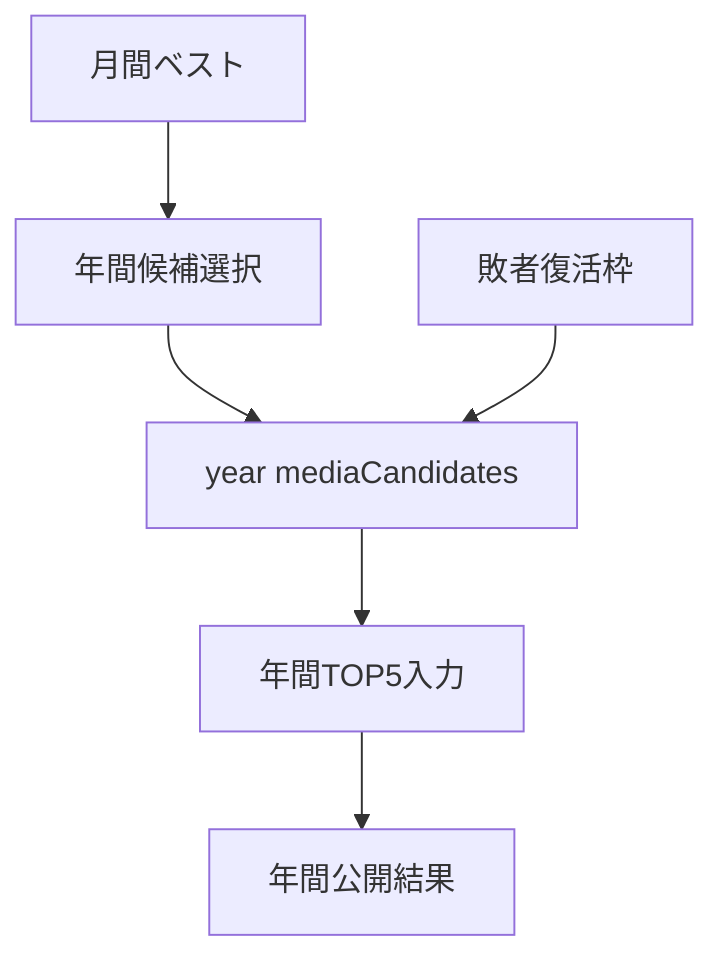
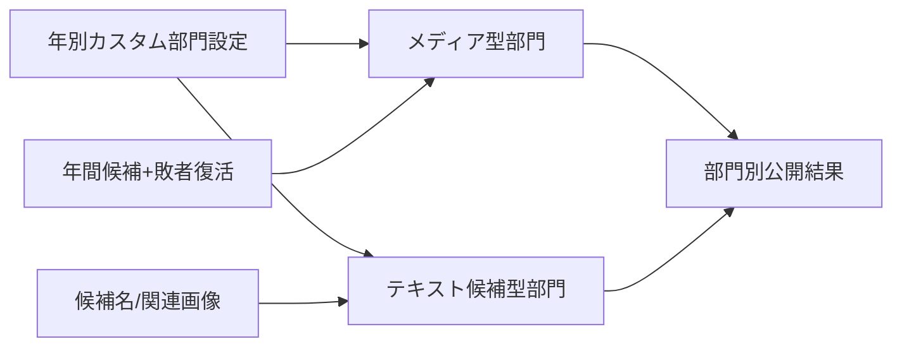
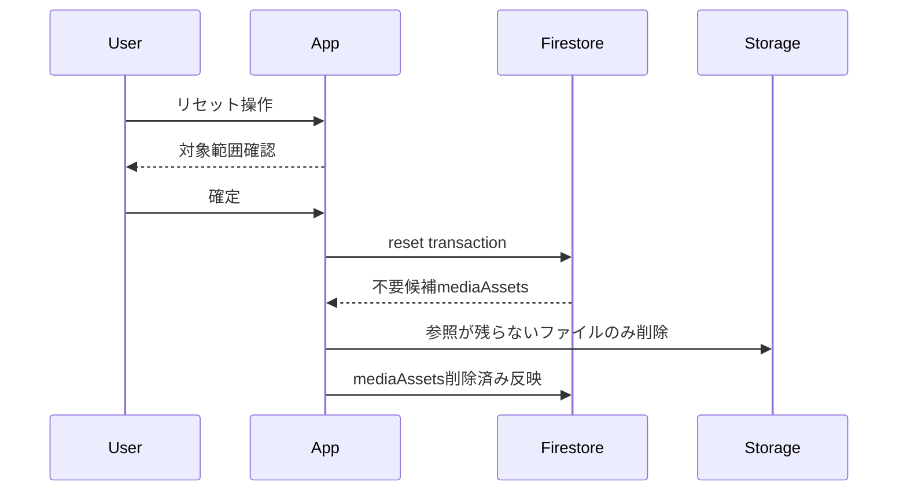
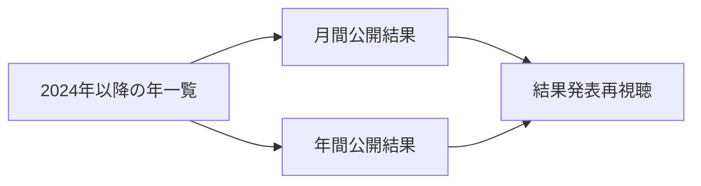

# SelectBestPhoto データフロー設計

## 1. 概要

この文書は、主要ユースケースのデータ移動、同期、公開条件、Storage参照を整理する。

- 要件名: select-best-photo
- 対象: SwiftUI iPhoneアプリ + Firebase
- 出典: `docs/spec/select-best-photo/requirements.md`、`docs/spec/select-best-photo/acceptance-criteria.md`、`docs/tech-stack.md`

## 2. 初回利用とペア参加

- 初回起動時にAnonymous Authenticationで内部ユーザーとして識別する。🔵
- ペアコードは短期限で、参加完了後に失効させる。🔵
- ペア参加後は `pairs/{pairId}` 配下のデータを同期対象にする。🔵

## 3. メディア登録

- ユーザーはアップロード対象を確認してからFirebaseへ送信する。🔵
- 通常の写真はJPEG互換、動画はH.264 MP4、Live Photosは静止画部分とモーション部分を対応付けて保存する。Live PhotosをJPEG単体として扱わない。🔵
- メタデータは原則保持し、GPSなど位置情報は除外する。🔵
- `mediaAssets` にはStorageパス、メディア種別、サムネイル参照、参照元、削除候補状態を保存する。🟡

## 4. 月間ベスト入力と公開

- 入力状態は未入力、入力中、入力完了で管理する。🔵
- 両者完了前は相手の入力内容を表示しない。🔵
- 公開用結果ドキュメントは個別入力とは分離し、両者完了後に作成する。🔵
- 月間データのリセットは対象月全体のリセットとして扱い、確認ダイアログを表示する。🔵

## 5. 年間候補と年間TOP5

- 年間候補件数は年ごと、月ごとに保持し、月間ベスト件数とは別にする。🔵
- 年間TOP5は自分と相手がそれぞれ入力し、両者完了後に公開結果を作成する。🔵
- 敗者復活枠で選んだメディアは、年間TOP5とメディア型カスタム部門の候補に含める。🔵

## 6. カスタム部門

- メディア型カスタム部門は年間ベスト候補からTOP3を選ぶ。🔵
- テキスト候補型部門は候補名、任意の関連画像、順位別ポイント、入力対象順位、発表対象順位を持つ。🔵
- `.csv` と手入力を安定対象にし、`.xlsx` は技術検証後に扱う。🔵
- テキスト候補型部門の結果はポイント設定に従って集計し、公開用結果へ保存する。🔵

## 7. リセットとStorage削除

- 月間、年間、部門、敗者復活のリセットは、それぞれ対象スコープ全体に対して実行する。🔵
- Storage削除は `mediaAssets` の参照元を確認し、他の入力や結果で使われる派生メディアを巻き込まない。端末またはiCloud写真ライブラリ上の元データは削除対象にしない。🔵
- 削除処理に失敗した場合はFirestoreに削除保留状態を残し、再試行できる設計にする。🟡

## 8. 過去結果閲覧

- 2024年以降の月間・年間結果を保持する。🔵
- 公開用結果ドキュメントを残すことで、リセットなしに結果発表演出を再視聴できる。🔵
- リセット後は再入力完了時に新しい公開結果を作成し、必要に応じて世代番号を持たせる。🟡

## 9. エラーと再試行

| 対象 | エラー例 | 方針 | 信頼性 |
| --- | --- | --- | --- |
| 認証 | Anonymous sign-in失敗 | 再試行導線を表示し、内部詳細は表示しない | 🔵 |
| ペアコード | 期限切れ、使用済み、存在しない | 参加不可理由をユーザー向けに表示 | 🔵 |
| メディア変換 | 読み込めない、圧縮失敗 | 対象ファイルを示して再選択または再試行 | 🔵 |
| Storage | アップロード失敗 | ローカル状態を保持して再試行 | 🟡 |
| 公開結果生成 | トランザクション競合 | 冪等な結果IDで再試行 | 🟡 |
| Storage削除 | 削除失敗 | 削除保留状態を残して後続再試行 | 🟡 |
