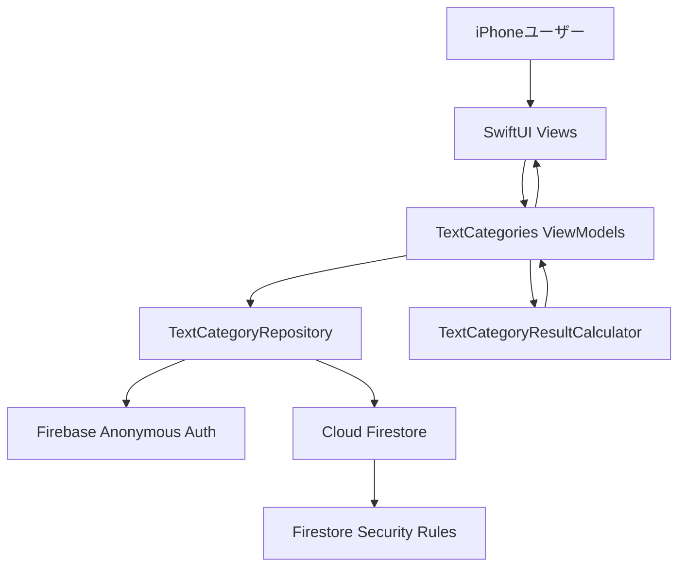
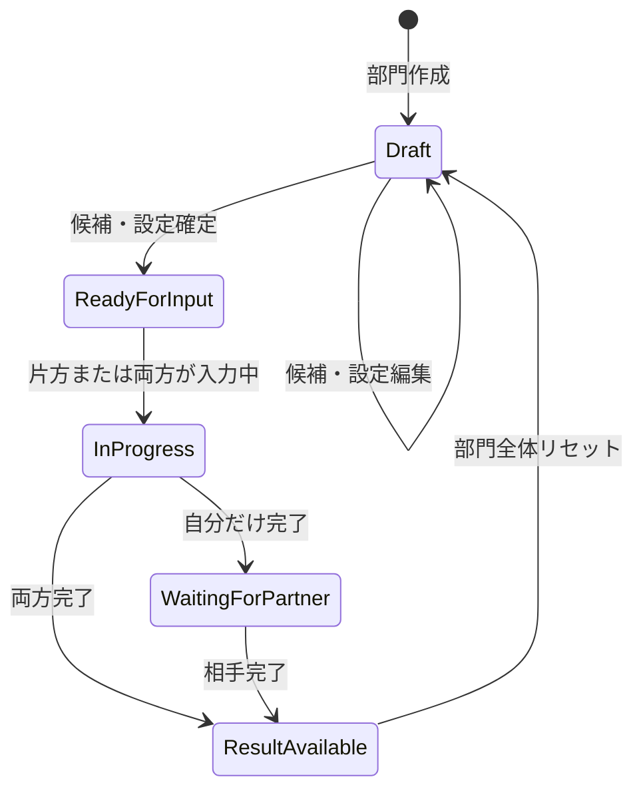

# テキスト候補型カスタム部門MVP アーキテクチャ設計

**作成日**: 2026-06-25
**関連要件定義**: [requirements.md](../../spec/text-candidate-category-mvp/requirements.md)
**ヒアリング記録**: [design-interview.md](design-interview.md)

## 信頼性レベル凡例

- 🔵 **青信号**: EARS要件定義書・設計文書・ユーザヒアリングを参考にした確実な設計
- 🟡 **黄信号**: EARS要件定義書・設計文書・ユーザヒアリングから妥当な推測による設計
- 🔴 **赤信号**: EARS要件定義書・設計文書・ユーザヒアリングにない推測による設計

## システム概要 🔵

**信頼性**: 🔵 `docs/spec/text-candidate-category-mvp/requirements.md`

テキスト候補型カスタム部門MVPは、カップル2人が年ごとに複数のテキスト候補部門を作り、候補と部門設定を確定した後、それぞれ順位付きで入力し、両者完了後にポイント集計結果を表示する機能である。

MVPでは候補の手入力、候補編集、候補削除、候補・設定確定、順位入力、入力完了、結果表示、部門全体リセットまでを対象にする。CSV / XLSX読み込み、関連画像選択、Cloud Storage保存は後続フェーズへ分離し、UI上は画像枠またはプレースホルダーだけを用意する。

## アーキテクチャパターン 🔵

**信頼性**: 🔵 `docs/tech-stack.md`, `docs/spec/text-candidate-category-mvp/note.md`

- **パターン**: SwiftUI + MVVM + Service/Repository
- **状態管理**: SwiftUI標準の状態管理とObservationを基本に、画面単位のViewModelで入力中状態を保持する
- **バックエンド**: Firebase Authentication + Cloud Firestore
- **API**: 独自REST APIは置かず、Firebase SDK経由でFirestoreへ読み書きする
- **選択理由**: 既存技術スタックがiOS 18以降、SwiftUI、Firebase BaaSを前提としており、個人開発・低コスト優先の方針に合うため

## コンポーネント構成

### App / Navigation 🔵

**信頼性**: 🔵 `SelectBestPhoto/App/SelectBestPhotoApp.swift`, `docs/tech-stack.md`

- `SelectBestPhotoApp` がアプリ起点になる
- `AppDelegate` でFirebase初期化を行う
- 主要画面へ移動するフッタータブを導入し、ホーム、発表、設定を含める
- テキスト候補部門は将来の月間ベスト、年間ベスト、カスタム部門と競合しないFeature配下へ配置する

### TextCategories Feature 🔵

**信頼性**: 🔵 `REQ-001`〜`REQ-019`, `UI-003`〜`UI-010`

- **部門一覧**: 年切り替え、対象年の部門一覧、入力状況、自分/相手の完了状態、結果表示可否を表示する
- **部門作成・設定**: 部門名、入力対象順位、発表対象順位、順位別ポイントを編集する
- **候補管理**: 候補名の追加、編集、削除、画像プレースホルダー、候補・設定確定を扱う
- **順位入力**: 確定済み部門で順位スロットと候補一覧を表示し、重複選択を防ぐ
- **待機**: 自分だけ完了した場合、相手の入力状況だけを表示する
- **結果**: 両者完了後に、発表対象順位までの候補名、合計ポイント、各ユーザー由来ポイント、画像枠を表示する
- **リセット**: 確認後、部門全体を未確定状態へ戻す

### Models 🔵

**信頼性**: 🔵 `REQ-006`〜`REQ-012`, `REQ-101`, `REQ-102`

- `TextCategory`: 年、部門名、確定状態、入力対象順位、発表対象順位、順位別ポイントを保持する
- `TextCandidate`: 候補ID、候補名、画像枠用の将来拡張フィールドを保持する
- `TextCategoryInput`: ユーザーごとの入力状態、順位選択、完了日時を保持する
- `TextCategoryResult`: 両者完了後の公開用集計結果を保持する
- `InputStatus`: `notStarted`, `inProgress`, `completed` を表す

### Services / Repository 🟡

**信頼性**: 🟡 `docs/tech-stack.md` と要件からの実装方針

- `TextCategoryRepository`: Firestoreの部門、候補、入力、結果を読み書きする
- `TextCategoryResultCalculator`: 2人分の順位入力と順位別ポイントから結果を計算する
- `PairContextProvider`: 現在の`pairId`と`userId`を提供する
- `Clock`または同等の依存: テスト可能な日時生成を行う
- ViewModelはFirebase SDKを直接触らず、Repository経由で操作する

## システム構成図 🔵

**信頼性**: 🔵 `docs/tech-stack.md`, `REQ-401`〜`REQ-405`



## Firestore構成方針 🔵

**信頼性**: 🔵 `REQ-401`, `REQ-405`, `NFR-101`, `NFR-102`

Firestoreの正本はペア配下に置く。

```text
pairs/{pairId}
└── years/{year}
    └── textCategories/{categoryId}
        ├── candidates/{candidateId}
        ├── inputs/{userId}
        └── results/{resultId}
```

- 部門は年単位で管理し、1年あたり30部門程度を想定する
- 候補は部門配下のサブコレクションで管理し、1部門あたり100件を想定する
- 入力は`inputs/{userId}`に分離し、自分の入力だけ編集可能にする
- 結果は両者完了後に公開可能な`results/{resultId}`へ保存する
- MVPではStorageを使わないため、候補画像はプレースホルダー表示のみとする

## 状態遷移 🔵

**信頼性**: 🔵 `REQ-109`, `REQ-110`, `REQ-201`〜`REQ-205`



- `Draft`: 候補と設定を編集できる。順位入力はできない
- `ReadyForInput`: 候補と設定を変更できない。順位入力できる
- `InProgress`: 少なくとも片方が入力中
- `WaitingForPartner`: 自分は完了、相手は未完了。相手入力内容と結果は表示しない
- `ResultAvailable`: 両方完了。結果を表示できる

## 集計方針 🔵

**信頼性**: 🔵 `REQ-011`, `REQ-012`, `NFR-002`

- 順位別ポイントは部門設定の`pointsByRank`で保持する
- 各ユーザー入力の`rank`からポイントを引き、候補IDごとに合算する
- 発表対象順位までを表示する
- 同点の場合は、合計ポイント、最高順位、候補作成順の順に安定ソートする
- 1部門最大100候補、2ユーザー、最大50順位のため、クライアント計算で即時表示できる

## セキュリティ方針 🔵

**信頼性**: 🔵 `REQ-402`〜`REQ-406`, `NFR-101`, `NFR-102`

- 認証済みユーザーだけがペア配下のデータへアクセスできる
- ペアに属する2人以外は、部門、候補、入力、結果を読めない
- 入力ドキュメントは本人のみ作成・更新可能
- 両者完了前は相手の入力ドキュメントを読ませない
- 結果ドキュメントは両者完了後のみ読める
- ペアコード、ユーザーID、候補内容など個人情報になり得る値を不要にログ出力しない

## ディレクトリ構造 🔵

**信頼性**: 🔵 `docs/tech-stack.md`, ユーザー確認2026-06-25

```text
SelectBestPhoto/
├── Features/
│   └── TextCategories/
│       ├── Views/
│       ├── ViewModels/
│       └── Components/
├── Models/
│   └── TextCategories/
├── Services/
│   └── Firebase/
└── Shared/
    ├── Components/
    └── Utilities/
```

## 非機能要件の実現方法

### パフォーマンス 🔵

**信頼性**: 🔵 `NFR-001`, `NFR-002`

- 1年30部門、1部門100候補、50順位を前提に画面を設計する
- 候補一覧はFirestoreのサブコレクションを部門単位で購読する
- 集計は最大100候補・2入力の線形処理で行う
- 大量候補でもSwiftUIリストの再描画負荷を抑えるため、候補IDを安定した`Identifiable`として使う

### 可用性・失敗時挙動 🔵

**信頼性**: 🔵 `EDGE-001`, `EDGE-002`

- 保存失敗時は入力中のローカル状態を破棄せず、再試行できる表示にする
- リセット失敗時はローカル表示を削除済みにせず、Firestoreから再取得できるようにする
- 結果生成失敗時は両者入力完了状態を維持し、再生成できる導線を残す

### ユーザビリティ 🔵

**信頼性**: 🔵 `NFR-201`〜`NFR-203`

- Dynamic Typeに対応したSwiftUI標準コンポーネントを優先する
- 44pt以上のタップ領域を確保する
- 入力順位、候補、入力状態、結果順位を視覚的に区別する
- リセットや削除は確認手段を必ず挟む

## MVP対象外 🔵

**信頼性**: 🔵 `REQ-301`, `REQ-302`, `REQ-407`

- CSV / XLSX読み込み
- 候補関連画像の選択、保存、アップロード
- Cloud Storage連携
- 月間ベスト、年間ベスト、メディア型カスタム部門、敗者復活枠

## 関連文書

- [dataflow.md](dataflow.md)
- [screen-structure.md](screen-structure.md)
- [interfaces.swift.md](interfaces.swift.md)
- [firestore-schema.md](firestore-schema.md)
- [security-rules.md](security-rules.md)
- [design-interview.md](design-interview.md)
- [requirements.md](../../spec/text-candidate-category-mvp/requirements.md)

## 信頼性レベルサマリー

- 🔵 青信号: 23件 (92%)
- 🟡 黄信号: 2件 (8%)
- 🔴 赤信号: 0件 (0%)

**品質評価**: 高品質。要件、技術スタック、現行実装の制約、ユーザー確認に基づき、実装判断が必要な箇所は🟡として明示している。
