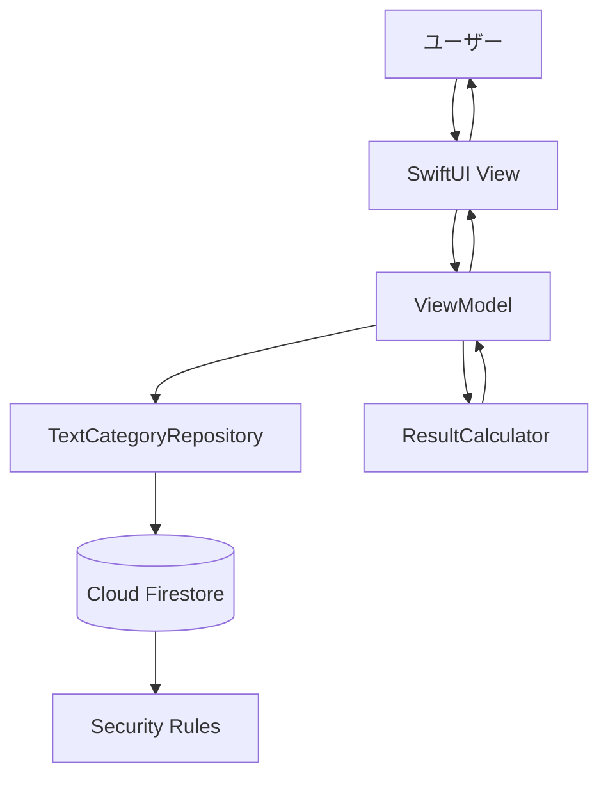
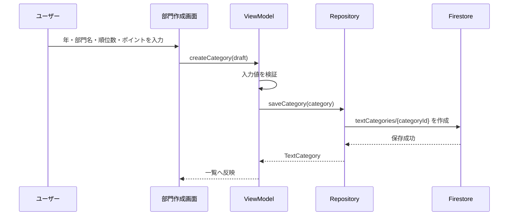
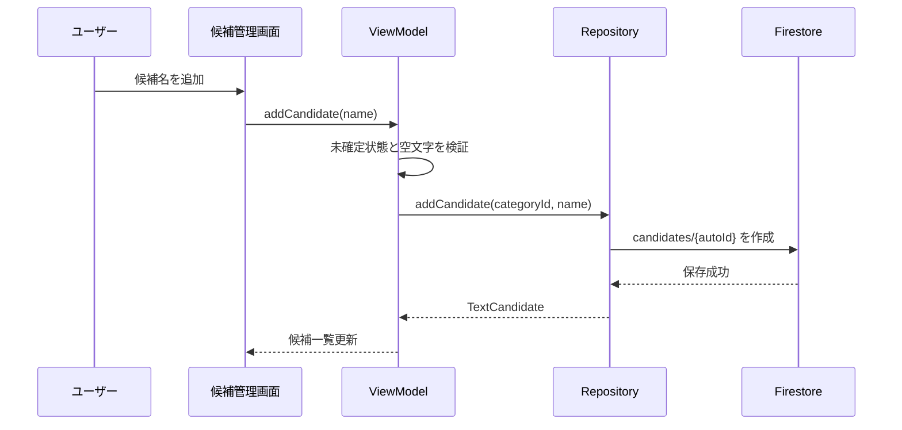
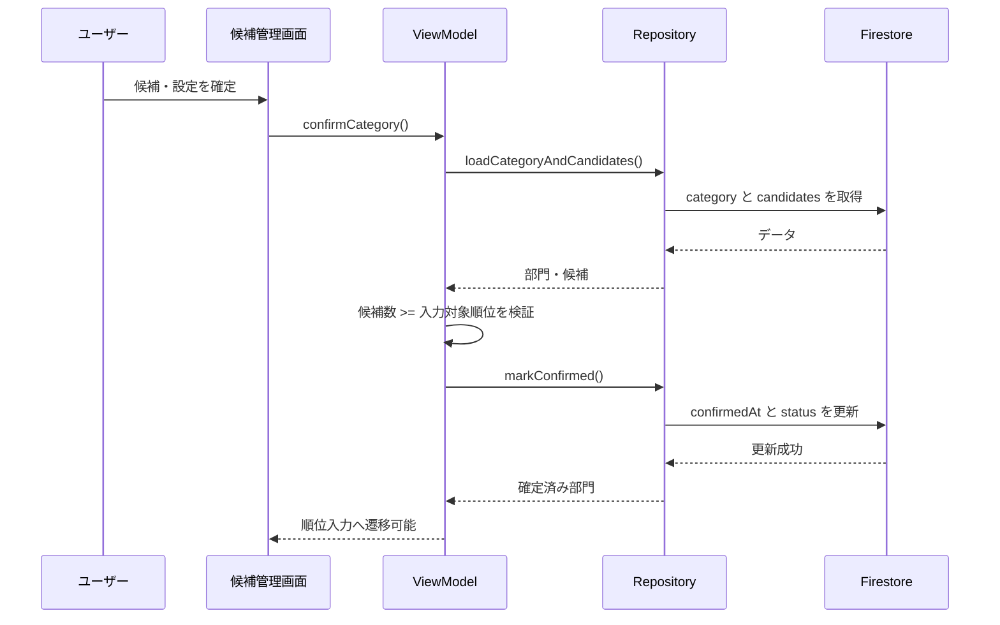
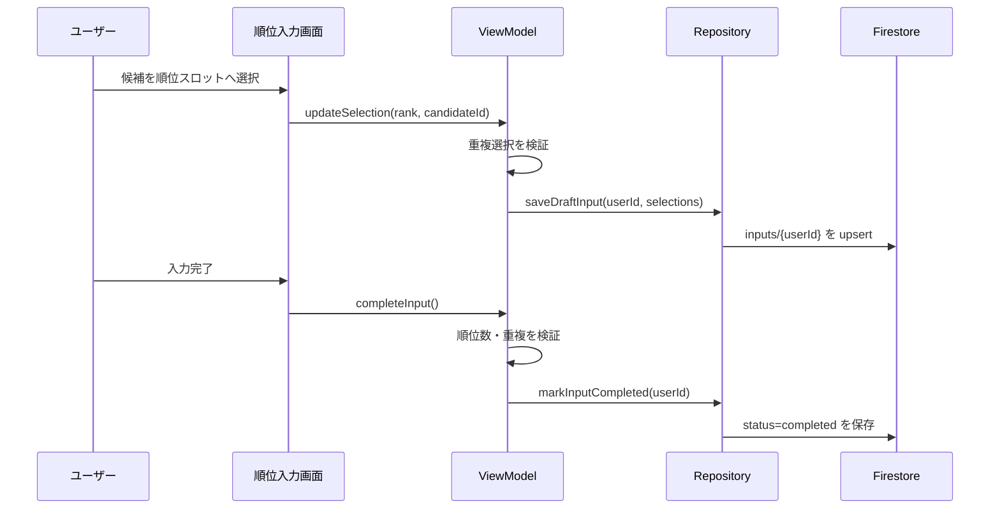
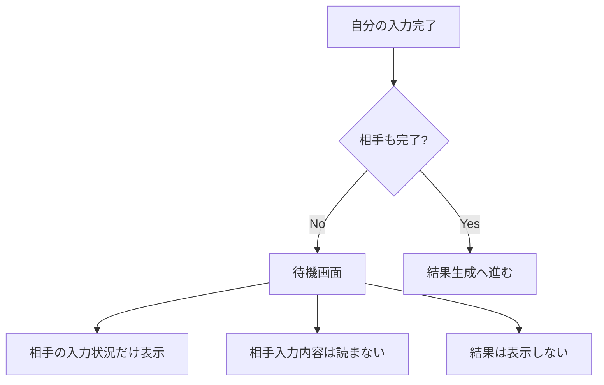
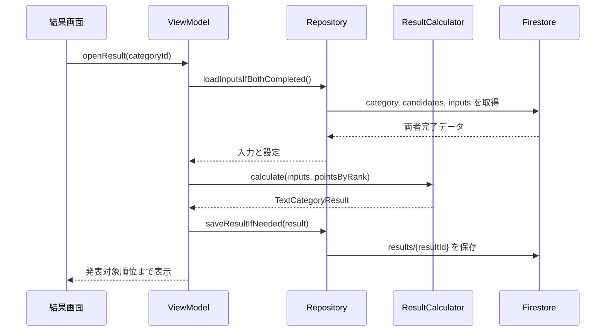
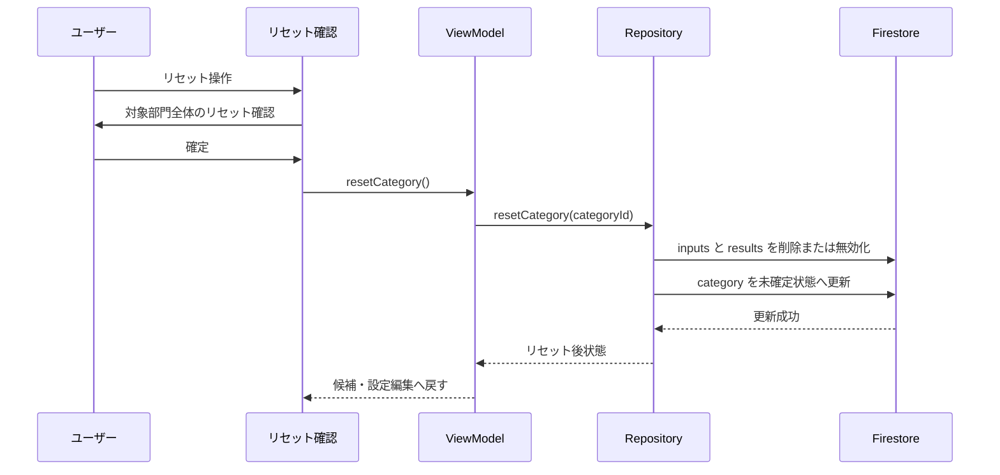
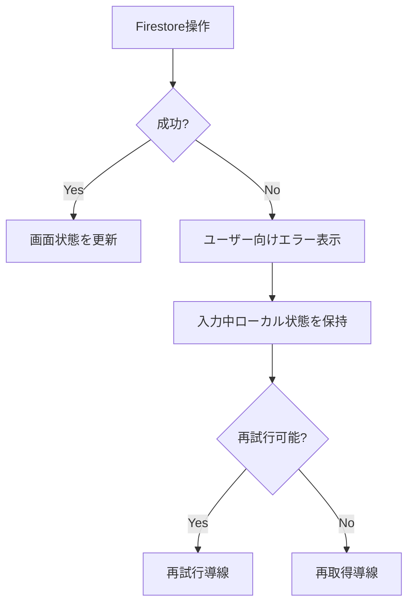

# テキスト候補型カスタム部門MVP データフロー図

**作成日**: 2026-06-25
**関連アーキテクチャ**: [architecture.md](architecture.md)
**関連要件定義**: [requirements.md](../../spec/text-candidate-category-mvp/requirements.md)

## 信頼性レベル凡例

- 🔵 **青信号**: EARS要件定義書・設計文書・ユーザヒアリングを参考にした確実なフロー
- 🟡 **黄信号**: EARS要件定義書・設計文書・ユーザヒアリングから妥当な推測によるフロー
- 🔴 **赤信号**: EARS要件定義書・設計文書・ユーザヒアリングにない推測によるフロー

## 全体データフロー 🔵

**信頼性**: 🔵 `REQ-001`〜`REQ-019`, `REQ-401`〜`REQ-405`

- 画面はViewModelへ操作を渡す
- ViewModelはRepository経由でFirestoreを読み書きする
- Security Rulesはペア所属、本人入力、結果公開条件を検証する
- 集計はクライアント内の計算器で行い、両者完了後に公開結果として保存する

## 機能別フロー

### 部門作成・設定 🔵

**信頼性**: 🔵 `REQ-001`, `REQ-002`, `REQ-006`〜`REQ-008`, `UI-005`

**検証**:

- 部門名は空にしない
- 入力対象順位、発表対象順位は1〜50
- 発表対象順位は入力対象順位以下
- 順位別ポイントは1以上

### 候補追加・編集・削除 🔵

**信頼性**: 🔵 `REQ-003`〜`REQ-005`, `REQ-107`, `REQ-108`, `REQ-110`

- 候補は自動IDで別候補として保存する
- 同名候補を禁止しない
- 確定済み部門では追加、編集、削除を拒否する
- 候補削除は確認UIを通す

### 候補・設定確定 🔵

**信頼性**: 🔵 `REQ-019`, `REQ-101`, `REQ-109`, `REQ-110`

- 候補数が入力対象順位未満の場合は確定できない
- 確定後は候補と設定を変更できない
- 既存入力との整合性を守るため、変更したい場合は部門全体リセットを行う

### 順位入力・入力完了 🔵

**信頼性**: 🔵 `REQ-009`, `REQ-010`, `REQ-102`, `REQ-203`

- 入力ドキュメントIDは`userId`
- 自分の入力だけ編集できる
- 同じ候補を複数順位に選べない
- 入力完了には入力対象順位分の選択が必要

### 待機・公開条件 🔵

**信頼性**: 🔵 `REQ-103`, `REQ-204`, `NFR-102`

- 待機中は入力状況だけを表示する
- 相手の選択候補、順位、ポイント由来情報は表示しない
- Firestore Rulesでも両者完了前の相手入力と結果読み取りを拒否する

### 結果生成・表示 🔵

**信頼性**: 🔵 `REQ-011`, `REQ-012`, `REQ-104`, `REQ-205`

- 結果は発表対象順位まで表示する
- 候補名、合計ポイント、各ユーザーの順位由来ポイント、画像枠を表示する
- リセットなしで再表示できるよう結果を保持する
- 保存済み結果が現在世代と一致する場合は再利用する。現在世代とは、部門リセットごとに更新される `generation` が現在の部門・入力・結果で一致している状態を指す

### 部門全体リセット 🔵

**信頼性**: 🔵 `REQ-013`, `REQ-014`, `REQ-105`, `REQ-106`

- 候補と部門設定は残す
- 2人分の順位入力、入力状態、生成済み結果を削除または無効化する
- 部門は確定前状態へ戻る
- 再確定後、2人が再入力できる

## エラーハンドリングフロー 🔵

**信頼性**: 🔵 `EDGE-001`, `EDGE-002`

- 保存失敗時は入力中の内容を可能な限り保持する
- リセット失敗時は削除済みに見せず、現状態を再取得する
- 内部エラー詳細、ペアコード、ユーザーID、候補内容を不要にログ出力しない

## データ整合性 🔵

**信頼性**: 🔵 `REQ-107`, `REQ-110`, `EDGE-003`

- 候補追加は自動IDで作成し、同時追加を失わない
- 確定後は候補と設定変更を禁止する
- 入力完了時に候補ID重複と順位数を検証する
- 結果生成時は、対象部門が確定済みで2人分の入力が完了していることを確認する
- リセット時は入力と結果を同じ操作単位で無効化し、部門だけ確定前へ戻す

## 関連文書

- [architecture.md](architecture.md)
- [screen-structure.md](screen-structure.md)
- [interfaces.swift.md](interfaces.swift.md)
- [firestore-schema.md](firestore-schema.md)
- [security-rules.md](security-rules.md)
- [requirements.md](../../spec/text-candidate-category-mvp/requirements.md)

## 信頼性レベルサマリー

- 🔵 青信号: 14件 (100%)
- 🟡 黄信号: 0件 (0%)
- 🔴 赤信号: 0件 (0%)

**品質評価**: 高品質。主要フローと結果再利用条件は要件、設計、ユーザー確認に直接紐づいている。
