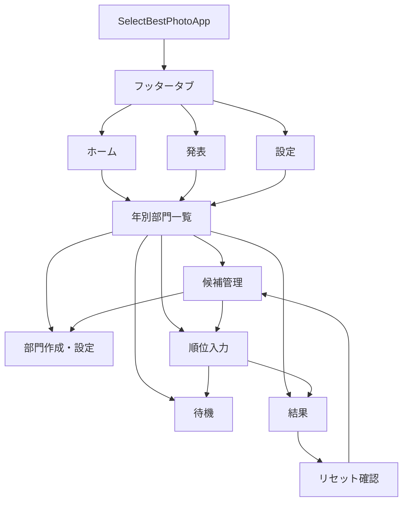
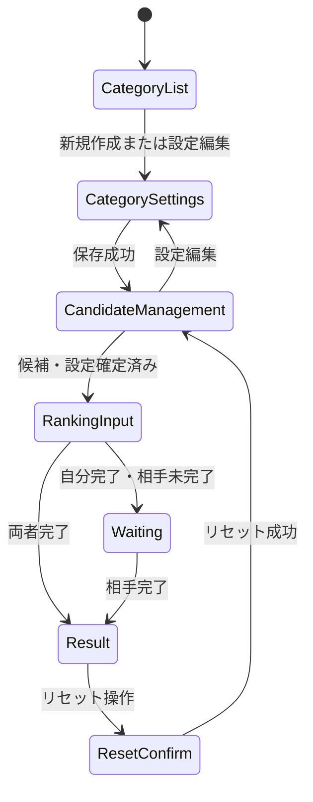

# テキスト候補型カスタム部門MVP 画面構成設計

**作成日**: 2026-06-25
**関連要件定義**: [requirements.md](../../spec/text-candidate-category-mvp/requirements.md)
**関連アーキテクチャ**: [architecture.md](architecture.md)
**関連データフロー**: [dataflow.md](dataflow.md)

## 信頼性レベル凡例

- 🔵 **青信号**: EARS要件定義書・設計文書・ユーザヒアリングを参考にした確実な設計
- 🟡 **黄信号**: EARS要件定義書・設計文書・ユーザヒアリングから妥当な推測による設計
- 🔴 **赤信号**: EARS要件定義書・設計文書・ユーザヒアリングにない推測による設計

## 画面構成の目的 🔵

**信頼性**: 🔵 `UI-001`〜`UI-010`, `NFR-201`〜`NFR-203`

この文書は、テキスト候補型カスタム部門MVPのSwiftUI実装に必要な画面、画面遷移、画面ごとの表示データ、主要操作、状態分岐を定義する。実装タスク分割時は、この文書をView / ViewModel / Componentの単位分解に使う。

## ナビゲーション全体 🔵

**信頼性**: 🔵 `UI-001`, `UI-002`, `UI-003`



- フッタータブはホーム、発表、設定を含める。
- テキスト候補型カスタム部門の入口は年別部門一覧に集約する。
- 月間ベスト、年間ベスト、他のカスタム部門を後続追加できるよう、テキスト候補型固有の画面は `Features/TextCategories` 配下に閉じる。
- SwiftUI標準の `TabView`、`NavigationStack`、`List`、`Form`、`confirmationDialog` または `alert` を優先する。

## 画面一覧 🔵

**信頼性**: 🔵 `UI-003`〜`UI-010`

| 画面 | 主な役割 | 主な遷移先 | 関連要件 |
| --- | --- | --- | --- |
| 年別部門一覧 | 年切り替え、部門一覧、入力状態、結果可否の確認 | 部門作成・設定、候補管理、順位入力、待機、結果 | `UI-003`, `UI-004` |
| 部門作成・設定 | 部門名、入力対象順位、発表対象順位、順位別ポイントの編集 | 候補管理、年別部門一覧 | `UI-005` |
| 候補管理 | 候補追加、編集、削除、画像枠確認、候補・設定確定 | 部門作成・設定、順位入力 | `UI-006` |
| 順位入力 | 順位スロットと候補一覧で自分の順位入力 | 待機、結果 | `UI-007` |
| 待機 | 自分完了後、相手の入力状況だけを表示 | 結果、年別部門一覧 | `UI-008` |
| 結果 | 発表対象順位までの集計結果を表示 | リセット確認、年別部門一覧 | `UI-009` |
| リセット確認 | 部門全体リセットの影響を確認 | 候補管理、結果 | `UI-010` |

## 画面遷移条件 🔵

**信頼性**: 🔵 `REQ-109`, `REQ-110`, `REQ-203`〜`REQ-205`



- 候補・設定が未確定の部門は順位入力へ進めない。
- 候補・設定が確定済みの部門は候補追加、候補編集、候補削除、設定変更を制限する。
- 自分だけ完了している場合は待機画面へ進み、相手入力内容と結果は表示しない。
- 両者完了後は結果画面へ進める。

## 年別部門一覧画面 🔵

**信頼性**: 🔵 `UI-003`, `UI-004`, `REQ-016`, `REQ-201`

### 表示データ

- 選択中の年
- 対象年のテキスト候補型カスタム部門一覧
- 各部門の候補・設定確定状態
- 自分の入力状態
- 相手の入力状態
- 結果表示可否

### 主要操作

- 年を切り替える。
- 新しい部門を作成する。
- 既存部門を開く。
- 結果表示可能な部門の結果を開く。

### 状態分岐

- 部門が0件の場合は、新規作成導線を表示する。
- `draft` の部門は候補管理または設定編集へ誘導する。
- `confirmed` で自分が未完了の場合は順位入力へ誘導する。
- 自分完了・相手未完了の場合は待機へ誘導する。
- 両者完了の場合は結果へ誘導する。

### UI方針

- 年切り替えはメニューを使う。
- 部門行は、部門名、状態バッジ、自分/相手の完了状態、結果可否を1行または2行で読める構成にする。
- 1年30部門程度に対応するため、縦スクロールの `List` を基本にする。

## 部門作成・設定画面 🔵

**信頼性**: 🔵 `UI-005`, `REQ-006`〜`REQ-008`, `EDGE-102`, `EDGE-103`

### 表示データ

- 部門名
- 入力対象順位
- 発表対象順位
- 順位別ポイント
- 保存状態または保存エラー

### 主要操作

- 部門名を入力する。
- 入力対象順位を1位から50位までの範囲で設定する。
- 発表対象順位を1位から入力対象順位までの範囲で設定する。
- 順位別ポイントを最大50行まで編集する。
- 下書き保存する。

### バリデーション

- 部門名は空にできない。
- 入力対象順位は1〜50。
- 発表対象順位は1〜入力対象順位。
- ポイントは1以上。
- 保存失敗時は入力中の値を保持する。

### UI方針

- 部門名はテキストフィールドで編集する。
- 入力対象順位と発表対象順位は数値入力を使う。
- 順位別ポイントは50行まで増えるため、固定の小さなフォームではなくスクロール可能なリストで扱う。

## 候補管理画面 🔵

**信頼性**: 🔵 `UI-006`, `REQ-003`〜`REQ-005`, `REQ-017`, `REQ-019`, `REQ-107`, `REQ-108`, `REQ-110`

### 表示データ

- 部門名
- 候補・設定確定状態
- 候補一覧
- 各候補の候補名
- 関連画像枠またはプレースホルダー
- 入力対象順位に対する候補数の充足状態

### 主要操作

- 候補を追加する。
- 候補名を編集する。
- 候補を削除する。
- 部門設定へ戻る。
- 候補・設定を確定する。

### バリデーション

- 候補名は空にできない。
- 同名候補は許容する。
- 候補数が入力対象順位未満の場合は確定できない。
- 確定済み部門では候補追加、編集、削除、設定変更を無効にする。
- 候補削除は確認を挟む。

### UI方針

- 候補一覧は最大100件を想定し、`List` または遅延読み込みされる縦リストを使う。
- 各候補行には将来の画像実装を見越した画像枠を表示する。
- MVPでは画像選択、保存、アップロードの操作は表示しない。
- 候補追加は画面下部の入力欄で行う。

## 順位入力画面 🔵

**信頼性**: 🔵 `UI-007`, `REQ-009`, `REQ-010`, `REQ-101`, `REQ-102`, `REQ-203`

### 表示データ

- 部門名
- 入力対象順位
- 順位スロット一覧
- 候補一覧
- 選択済み候補
- 未選択順位
- 自分の保存状態

### 主要操作

- 順位スロットに候補を選択する。
- 選択済み順位を変更する。
- 選択を解除する。
- 入力を保存する。
- 入力完了する。

### バリデーション

- 同じ候補を複数順位に選べない。
- 入力完了時は入力対象順位分の選択が必要。
- 候補数が入力対象順位未満の場合は入力完了を許可しない。
- 候補・設定が未確定の場合は順位入力を許可しない。

### UI方針

- 最大50順位を扱うため、順位スロットはスクロール可能なリストで表示する。
- 候補100件から選ぶ操作は、検索できるシートを表示し、候補行をタップして順位スロットへ設定する。
- 選択済み候補と未選択順位は視覚的に区別する。
- 入力完了ボタンは、完了条件を満たすまで無効にする。

## 待機画面 🔵

**信頼性**: 🔵 `UI-008`, `REQ-103`, `REQ-204`, `NFR-102`

### 表示データ

- 自分の入力完了状態
- 相手の入力完了状態
- 結果公開まで待機中であること

### 表示してはいけないデータ

- 相手の候補選択内容
- 相手の順位
- 相手の順位由来ポイント
- 両者完了前の集計結果

### 主要操作

- 入力状態を再取得する。
- 部門一覧へ戻る。
- 両者完了後に結果へ進む。

### UI方針

- 待機中は相手の入力内容を推測できる情報を出さない。
- Firestore Rulesで読めないデータをUI表示条件に使わない。
- 再取得または自動更新で結果表示可能状態へ遷移する。

## 結果画面 🔵

**信頼性**: 🔵 `UI-009`, `REQ-011`, `REQ-012`, `REQ-015`, `REQ-104`, `REQ-205`

### 表示データ

- 部門名
- 発表対象順位
- 候補名
- 合計ポイント
- 各ユーザーの順位由来ポイント
- 関連画像枠またはプレースホルダー

### 主要操作

- 結果を再表示する。
- 部門一覧へ戻る。
- 部門全体リセットを開始する。

### 状態分岐

- 両者完了前は結果を表示しない。
- 結果生成に失敗した場合は、入力完了状態を維持して再試行導線を表示する。
- 保存済み結果が現世代と一致する場合は再利用できる。ここでの現世代とは、部門リセットごとに更新される `generation` が現在の部門・入力・結果で一致している状態を指す。古い世代の結果を再表示しないための判定である。

### UI方針

- 発表対象順位までの結果を下位から順番に1件ずつ表示し、一気に全件表示しない。
- 1位、2位などの上位は視覚的に区別できる余地を残す。
- 結果発表の演出詳細はMVP実装時に過度に作り込まず、後続で強化できる構造にする。

## リセット確認 🔵

**信頼性**: 🔵 `UI-010`, `REQ-013`, `REQ-014`, `REQ-105`, `REQ-106`, `EDGE-002`

### 表示データ

- 対象部門名
- リセット対象が部門全体であること
- 候補と部門設定は残ること
- 2人分の順位入力、入力状態、生成済み結果が削除または無効化されること

### 主要操作

- リセットを確定する。
- リセットをキャンセルする。

### UI方針

- 誤操作の影響が大きいため、`confirmationDialog` または `alert` を必ず挟む。
- リセット失敗時は削除済みに見せず、現在状態を再取得できるようにする。
- リセット成功後は候補・設定編集へ戻す。

## 共通エラー・ローディング 🔵

**信頼性**: 🔵 `EDGE-001`, `EDGE-002`, `NFR-203`

- 初回読み込み中はローディング状態を表示する。
- Firestore保存失敗時は、ユーザーが次に取る行動を理解できる文言で表示する。
- 入力中のフォーム値や順位選択は、保存失敗だけで破棄しない。
- 権限エラーや公開条件未達の場合は、相手入力内容や結果を表示せず、部門一覧または待機状態へ戻す。
- 内部エラー詳細、ペアコード、ユーザーID、候補内容を不要にログ出力しない。

## コンポーネント分割案 🔵

**信頼性**: 🔵 `architecture.md`, 画面要件, ユーザー確認2026-06-25

```text
SelectBestPhoto/Features/TextCategories/
├── Views/
│   ├── TextCategoryListView.swift
│   ├── TextCategorySettingsView.swift
│   ├── TextCandidateManagementView.swift
│   ├── TextRankingInputView.swift
│   ├── TextCategoryWaitingView.swift
│   └── TextCategoryResultView.swift
├── ViewModels/
│   ├── TextCategoryListViewModel.swift
│   ├── TextCategorySettingsViewModel.swift
│   ├── TextCandidateManagementViewModel.swift
│   ├── TextRankingInputViewModel.swift
│   └── TextCategoryResultViewModel.swift
└── Components/
    ├── TextCategoryStatusBadge.swift
    ├── TextCandidateRow.swift
    ├── TextCandidateImagePlaceholder.swift
    ├── RankSlotRow.swift
    └── ResultEntryRow.swift
```

- 画面ごとにViewModelを分け、Firestore操作はRepositoryへ委譲する。
- 候補行、順位スロット、画像プレースホルダー、結果行は再利用コンポーネントにする。
- 実装時に画面状態が単純なら、ViewModelを統合してもよい。

## アクセシビリティ・iPhone制約 🔵

**信頼性**: 🔵 `NFR-201`〜`NFR-203`, `AGENTS.md`

- iPhone専用として、縦スクロール中心で破綻しないレイアウトにする。
- Dynamic Typeで行高が増えても、ボタンやテキストが重ならないようにする。
- 主要操作は44pt以上のタップ領域を確保する。
- VoiceOverで順位、候補名、選択状態、入力完了状態、結果順位が理解できるラベルを付ける。
- 候補100件、順位50件、ポイント設定50行は、固定高さの小さな領域に押し込まず、画面単位またはスクロール領域で扱う。

## MVP対象外 🔵

**信頼性**: 🔵 `REQ-301`, `REQ-302`, `REQ-407`

- CSV / XLSX読み込み画面
- 候補関連画像の選択画面
- 候補関連画像の保存、アップロード、削除UI
- Cloud Storage連携状態表示
- 結果発表の高度な演出

## タスク分割へのメモ 🔵

**信頼性**: 🔵 画面遷移とユーザー確認2026-06-25

1. 年別部門一覧とナビゲーションを作る。
2. 部門作成・設定を作る。
3. 候補管理と画像プレースホルダーを作る。
4. 候補・設定確定と状態制御を作る。
5. 順位入力を作る。
6. 待機と公開条件表示を作る。
7. 結果表示を作る。
8. リセット確認とリセット後遷移を作る。

## 信頼性レベルサマリー

- 🔵 青信号: 26件 (100%)
- 🟡 黄信号: 0件 (0%)
- 🔴 赤信号: 0件 (0%)

**品質評価**: 高品質。画面構成、主要UI判断、結果表示順、結果再利用条件は要件定義の `UI-001`〜`UI-010` とユーザー確認に直接紐づいている。
